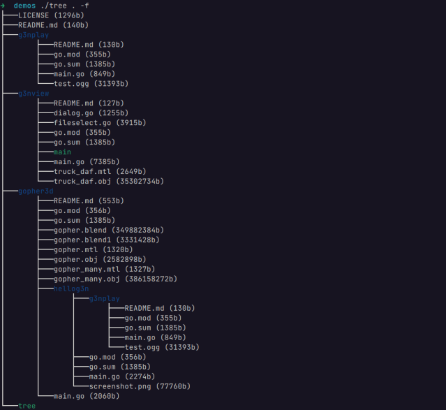

# Tree utility

List contents of directories in a tree-like format.




## Description

Tree is a recursive directory listing program that produces a depth indented listing of files.

## Getting Started

### Build program

```bash
go build -o tree main.go
```

### Executing program

* How to run the program
```
tree /path/to/directory/ -f
```

## Params

* You can add ```-f``` options for print file size